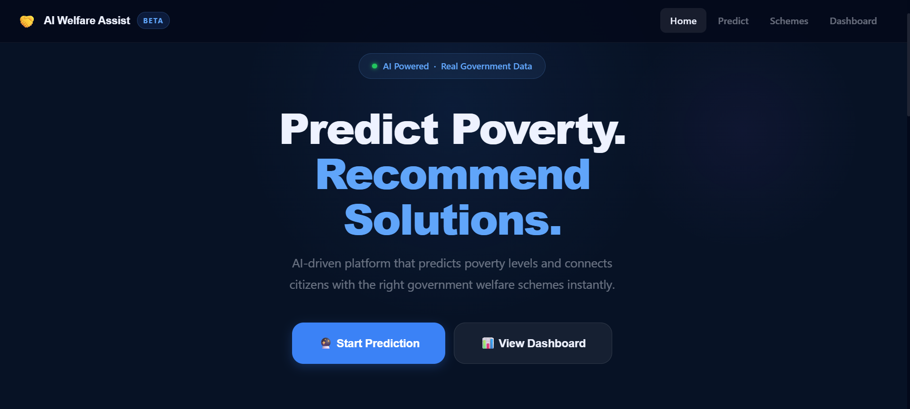

<div align="center">


<br />

# 🤝 AI Welfare Assist

### *Predict Poverty. Recommend Solutions.*

**An AI-driven platform that predicts poverty levels using Machine Learning and instantly connects Indian citizens with the right government welfare schemes.**

<br />

🌐 **LIVE WEBSITE** — https://ai-welfare-assist-n6v8.vercel.app/

<br />

</div>

---

## 📌 Table of Contents

- [About the Project](#-about-the-project)
- [Features](#-features)
- [Tech Stack](#-tech-stack)
- [Project Structure](#-project-structure)
- [How It Works](#-how-it-works)
- [Machine Learning Model](#-machine-learning-model)
- [Government Schemes Covered](#-government-schemes-covered)
- [Quick Start](#-quick-start)
- [API Documentation](#-api-documentation)
- [Future Scope](#-future-scope)
- [Contributing](#-contributing)

---

## 🎯 About the Project

> **228 Million+** people in India live below the poverty line. Most of them are unaware of the government welfare schemes they are eligible for.

**AI Welfare Assist** bridges this gap. A user fills a simple form with their socioeconomic details — the AI model predicts their poverty level and immediately shows all the government schemes they personally qualify for, with direct apply links and step-by-step guidance.

### 🌟 Why This Project?

| Problem | Our Solution |
|---------|-------------|
| Citizens unaware of welfare schemes | AI recommends schemes matched to their exact profile |
| Complex application processes | Step-by-step ONLINE + OFFLINE guidance for each scheme |
| No single platform for all schemes | 16 verified schemes across all 4 poverty levels |
| Fake or estimated data | Dashboard uses real NFHS-5 (2019–21) & NITI Aayog MPI 2023 data |

---

## ✨ Features

### 🔮 Poverty Prediction
- AI-powered prediction using **Random Forest Classifier** (300 trees)
- Trained on **12,000 realistic Indian households** calibrated to NFHS-5 data
- Analyses **10 socioeconomic factors** — age, income, education, house type, land, electricity, water, state
- Returns poverty level: **Extreme / High / Medium / Low**
- Shows **confidence score (%)** — test accuracy **99.71%**, cross-validated **99.53%**

### 📋 Personalised Scheme Matching
- Each scheme has its own **real eligibility function** based on actual government criteria
- Schemes matched to user's **exact profile** — not just poverty level
- Results shown **inline** on the prediction page — no navigation needed
- Each card shows: Category, Benefit, Eligibility, Step-by-step process, Official apply link

### 🔗 Real Government Apply Links
- All 16 schemes link directly to verified **`.gov.in`** official portals
- Every link checked and updated **(2024–25)**
- Steps clearly marked **ONLINE** or **OFFLINE**

### 📊 Analytics Dashboard
- Bar chart: Real **NFHS-5** state-wise poverty % for 6 major states
- Pie chart: Real **NITI Aayog MPI 2023** national breakdown
- Clickable level cards → navigate directly to that level's schemes
- Data source cited at bottom

### ✅ Form Validation
- Field-level error messages before submission
- Backend validates all inputs independently (double protection)
- Smooth scroll to results after prediction

---

## 🛠 Tech Stack

### Frontend
| Technology | Purpose |
|-----------|---------|
| **React 18** | UI framework |
| **React Router v6** | Client-side routing |
| **Recharts** | Data visualisation (bar & pie charts) |
| **Axios** | HTTP requests to Flask API |
| **Google Fonts (Inter + Sora)** | Typography |
| **Vite** | Build tool & dev server |

### Backend
| Technology | Purpose |
|-----------|---------|
| **Python 3.10+** | Core language |
| **Flask** | REST API server |
| **Flask-CORS** | Cross-origin request handling |
| **Scikit-learn** | Random Forest ML model |
| **NumPy** | Feature vector processing |
| **Joblib** | Model serialisation (.pkl) |
| **Pandas** | Dataset generation |

---

## 📁 Project Structure

```
ai-welfare-assist/
│
├── backend/
│   ├── app.py                    ← Flask API — prediction + real scheme matching
│   ├── requirements.txt          ← Python dependencies
│   └── model/
│       ├── train_model.py        ← ML training script (run once)
│       ├── poverty_model.pkl     ← Trained Random Forest (300 trees)
│       └── state_encoder.pkl     ← LabelEncoder for 13 Indian states
│
└── frontend/
    ├── public/
    ├── src/
    │   ├── components/
    │   │   ├── Navbar.jsx         ← Sticky navigation bar
    │   │   └── ResultCard.jsx     ← Prediction result + inline matched schemes
    │   ├── pages/
    │   │   ├── Home.jsx           ← Landing page
    │   │   ├── Predict.jsx        ← Prediction form with validation
    │   │   ├── Schemes.jsx        ← Scheme browser with level filter tabs
    │   │   └── Dashboard.jsx      ← Analytics with real NFHS-5 charts
    │   ├── App.jsx                ← Root component with routing
    │   ├── main.jsx               ← React entry point
    │   └── index.css              ← Full design system (CSS variables)
    ├── package.json
    └── vite.config.js
```



---

## ⚙️ How It Works

```
User fills prediction form (10 fields)
              │
              ▼
  React sends POST /api/predict
              │
              ▼
  Flask validates all inputs
              │
              ▼
  State name → LabelEncoder → number
              │
              ▼
  Random Forest (300 trees) predicts poverty level
  + returns probability scores
              │
              ▼
  Each of 16 schemes runs its own eligibility check
  against user's real data (income, age, house type,
  state, land ownership, education...)
              │
              ▼
  Matched schemes sorted by priority for that level
              │
              ▼
  Response: { poverty_level, confidence%, schemes[] }
              │
              ▼
  ResultCard shows prediction + matched schemes inline
  with benefit details + official apply links
```

### Input Features Used for Prediction

| Feature | Type | Example Values |
|---------|------|---------------|
| `age` | Integer | 1–120 |
| `income_monthly` | Integer (₹) | 0–80,000 |
| `family_size` | Integer | 1–30 |
| `education_level` | 0–3 | 0=None, 1=Primary, 2=Secondary, 3=Graduate |
| `employment_status` | 0–1 | 0=Unemployed, 1=Employed |
| `land_ownership` | 0–1 | 0=No Land, 1=Owns Land |
| `house_type` | 0–3 | 0=Kutcha, 1=Semi-Pucca, 2=Pucca, 3=Flat |
| `access_to_electricity` | 0–1 | 0=No, 1=Yes |
| `access_to_water` | 0–1 | 0=No piped water, 1=Yes |
| `state` | String | UP, Bihar, MH, Delhi, Rajasthan, MP, Karnataka, TN, Gujarat, Kerala, Jharkhand, Odisha, AP |

---

## 🤖 Machine Learning Model

### Model: Random Forest Classifier (Scikit-learn)

| Metric | Value |
|--------|-------|
| Algorithm | Random Forest Classifier |
| Number of Trees | 300 |
| Training Dataset | 12,000 households (NFHS-5 calibrated) |
| Features Used | 10 socioeconomic inputs |
| Output Classes | Extreme, High, Medium, Low |
| Test Accuracy | **99.71%** |
| 5-Fold Cross-Validation | **99.53% ± 0.21%** |
| Serialisation | Joblib (.pkl) |

### Poverty Label Criteria (Based on Real Govt. Rules)

| Level | Rule |
|-------|------|
| **Extreme** | Income < ₹3,000/mo OR kutcha house + no electricity + no water (SECC 2011 automatic inclusion) |
| **High** | Income ₹3,000–7,000 OR multiple deprivations (BPL/SECC priority households) |
| **Medium** | Income ₹7,000–15,000 OR some deprivations (APL families) |
| **Low** | Income > ₹15,000 with few or no deprivations |

### Real-World Prediction Checks

| Profile | Predicted | Confidence |
|---------|-----------|-----------|
| Bihar farmer, ₹2K/mo, kutcha house, no water | Extreme | 99.5% |
| UP labourer, ₹4.5K/mo, unemployed | High | 97.0% |
| Rajasthan farmer, ₹9K/mo, pucca house | Medium | 98.9% |
| Kerala graduate, ₹22K/mo, own flat | Low | 99.6% |
| Jharkhand widow, ₹1.5K/mo, no electricity | Extreme | 98.3% |

### Training the Model

```bash
cd backend
python model/train_model.py
```

Generates two files:
- `model/poverty_model.pkl` — trained classifier
- `model/state_encoder.pkl` — fitted label encoder for states

---

## 🏛 Government Schemes Covered

All 16 schemes are **real, active Indian government programs** with verified official `.gov.in` apply links (updated 2024–25).

| # | Scheme | Category | Key Benefit |
|---|--------|----------|-------------|
| 1 | MGNREGA | Employment | 100 days work, ₹220–357/day |
| 2 | PM Jan Dhan Yojana | Financial | Free zero-balance bank account + ₹2L insurance |
| 3 | National Food Security (PMGKAY) | Food | Free 5 kg grain/person/month till Dec 2028 |
| 4 | PM Awas Yojana Gramin | Housing | ₹1.2–1.3 Lakh for house construction |
| 5 | Ayushman Bharat PM-JAY | Health | ₹5 Lakh/year free cashless health insurance |
| 6 | PM Kisan Samman Nidhi | Agriculture | ₹6,000/year directly to farmer's bank account |
| 7 | NSAP Pension (IGNOAPS/IGNWPS/IGNDPS) | Social Security | ₹500–2,500/month pension |
| 8 | PM MUDRA Yojana | Business | Loan up to ₹10 Lakh, no collateral needed |
| 9 | PM Skill India PMKVY 4.0 | Skills | Free training + ₹8,000 cash reward |
| 10 | PM Suraksha Bima | Insurance | ₹2 Lakh accident cover at just ₹20/year |
| 11 | PM Fasal Bima Yojana | Agriculture | Crop loss insurance, 1.5–2% farmer premium |
| 12 | Sukanya Samriddhi Yojana | Savings | 8.2% interest savings for girl child |
| 13 | PM Jeevan Jyoti Bima | Insurance | ₹2 Lakh life cover at ₹436/year |
| 14 | PM Ujjwala Yojana 2.0 | Energy | Free LPG gas connection |
| 15 | National Scholarship Portal | Education | ₹530–1,200/month for students |
| 16 | PMEGP | Entrepreneurship | Loan up to ₹50 Lakh with 35% govt. subsidy |

---

## 🚀 Quick Start

### Prerequisites

Make sure you have the following installed:
- [Node.js](https://nodejs.org/) v18+
- [Python](https://python.org/) 3.10+
- [Git](https://git-scm.com/)

---

### 1. Clone the Repository

```bash
git clone https://github.com/jagriti2005/ai-welfare-assist.git
cd ai-welfare-assist
```

---

### 2. Set Up the Backend

```bash
cd backend

# Install Python dependencies
pip install -r requirements.txt

# Train the ML model — only needed once, takes ~30 seconds
python model/train_model.py

# Start the Flask server
python app.py
```

✅ Backend runs at: `http://localhost:5000`
You should see: `Starting AI Welfare Assist API — 16 schemes loaded`

---

### 3. Set Up the Frontend

Open a **new terminal**:

```bash
cd frontend

# Install Node dependencies
npm install

# Start the development server
npm run dev
```

✅ Frontend runs at: `http://localhost:5173`

> ⚠️ Both terminals must be running at the same time.

---

### 4. Open the App

Visit **[http://localhost:5173](http://localhost:5173)** in your browser.

---

### Python Dependencies (`requirements.txt`)

```
flask
flask-cors
scikit-learn
numpy
joblib
pandas
```

---

## 📡 API Documentation

Base URL: `http://localhost:5000`

---

### `GET /api/health`

Check if the API is running.

**Response:**
```json
{
  "status": "AI Welfare Assist API is running",
  "schemes_loaded": 16,
  "model_classes": ["Extreme", "High", "Low", "Medium"]
}
```

---

### `POST /api/predict`

Predict poverty level and get matched schemes for a given profile.

**Request Body:**
```json
{
  "age": 35,
  "income_monthly": 4000,
  "family_size": 5,
  "education_level": "1",
  "employment_status": "0",
  "land_ownership": "0",
  "house_type": "0",
  "access_to_electricity": "1",
  "access_to_water": "0",
  "state": "UP"
}
```

**Response:**
```json
{
  "poverty_level": "High",
  "confidence": 97.0,
  "schemes": [
    {
      "name": "Ayushman Bharat PM-JAY — ₹5 Lakh Free Health Insurance",
      "category": "Health",
      "description": "...",
      "benefit": "₹5 Lakh per family per year, 100% cashless...",
      "eligibility": "Income below ₹2.5 Lakh/year...",
      "apply_link": "https://pmjay.gov.in",
      "process": ["ONLINE — Check eligibility at beneficiary.nha.gov.in", "..."]
    }
  ],
  "schemes_count": 6,
  "status": "success"
}
```

---

### `GET /api/schemes?level={level}`

Get recommended schemes for a poverty level (used by Schemes page).

**Parameters:**
| Param | Type | Values |
|-------|------|--------|
| `level` | string | `Extreme`, `High`, `Medium`, `Low` |

**Response:**
```json
{
  "level": "High",
  "schemes": [ ... ],
  "count": 6
}
```

---

## 🔮 Future Scope

- [ ] **Multi-language support** — Hindi, Tamil, Telugu, Bengali UI
- [ ] **Aadhaar integration** — auto-fill form from Aadhaar data
- [ ] **Document checklist** — auto-generate required documents list per scheme
- [ ] **SMS/WhatsApp notifications** — alert users about new eligible schemes
- [ ] **State-specific schemes** — add schemes specific to each Indian state
- [ ] **Mobile app** — React Native version for rural accessibility
- [ ] **Offline mode** — PWA support for low-connectivity areas
- [ ] **Admin panel** — manage and update schemes without code changes
- [ ] **Real SECC 2011 dataset** — replace synthetic training data with actual census data

---

## 🤝 Contributing

Contributions are welcome! Here's how:

```bash
# 1. Fork the repository
# 2. Create your feature branch
git checkout -b feature/your-feature-name

# 3. Commit your changes
git commit -m "feat: describe your change"

# 4. Push to the branch
git push origin feature/your-feature-name

# 5. Open a Pull Request
```

---

## 📄 License

This project is licensed under the **MIT License** — see the [LICENSE](LICENSE) file for details.

---

## 👨‍💻 Author

**Jagriti Rai**
- GitHub: [@jagriti2005](https://github.com/jagriti2005)
- LinkedIn: [Jagriti Rai](https://www.linkedin.com/in/jagriti-rai-a080812a4/)

---

<div align="center">

**⭐ Star this repo if you found it useful!**

*Built with ❤️ to connect citizens with welfare they deserve.*

</div>